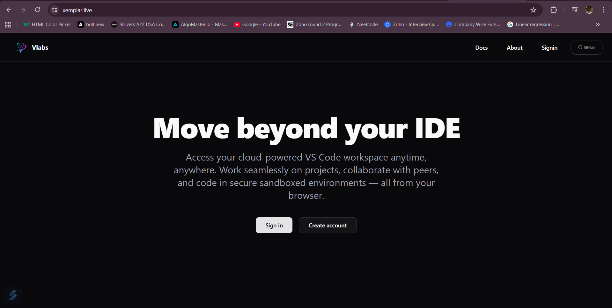
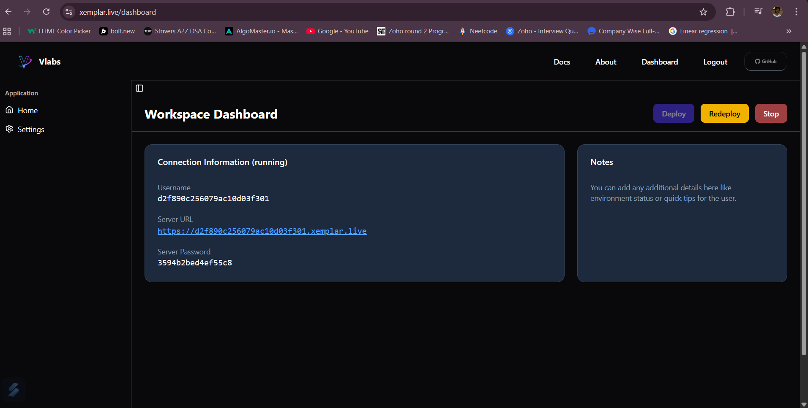
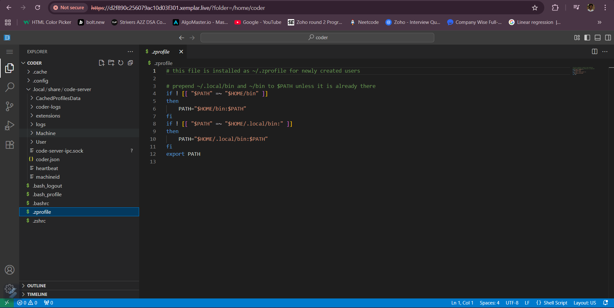

# 🚀 **VLab – Your Personal Cloud Workspace**

### **Move beyond your IDE**
VLab is a next-generation **cloud workspace platform** that lets students, developers, and teams create and access their own **sandboxed development environments** from anywhere.  
Each workspace runs securely in the cloud, giving users complete control — just like a personal system — accessible from any device.

## 🛠️ **Tech Stack**

- **Frontend:** React + TailwindCSS  
- **Backend:** Node.js + Express / Supabase 
- **Containerization:** Docker  
- **Network Management:** Docker Networks / Bridge / Traefik 
- **Authentication:** JWT / OAuth  
- **Reverse Proxy:** Nginx  
- **Deployment:** AWS   

## 🧠 **Overview**

VLab provides every user with their own **dedicated virtual workspace**, running inside an isolated containerized environment.  
This means:
- 💻 You can code, compile, and run applications securely  
- 🧑‍💻 Each user workspace is private and persistent  
- ☁️ You can connect via **browser or SSH** from anywhere  
- 🛠️ Ideal for **education, research, and software development**  

---

## 🖼️ **Screenshots**

### 🔹 Workspace Dashboard  

### 🔹 Terminal & File Access  

---

## ⚙️ **Key Features**

| Feature | Description |
|----------|--------------|
| 🧩 Isolated Workspaces | Each user gets a secure, independent environment |
| ☁️ Accessible Anywhere | Log in and access your workspace from any device |
| 🔐 Secure Sandboxing | No interference between users; controlled resource access |
| ⚡ Instant Setup | New workspaces start in seconds |
| 🧰 Developer Ready | Preloaded with coding tools, compilers, and utilities |
| 🔄 Persistent Storage | Workspace files are saved for future sessions |
| 🌍 Multi-Device Access | Continue your work seamlessly on laptop or mobile |

---

